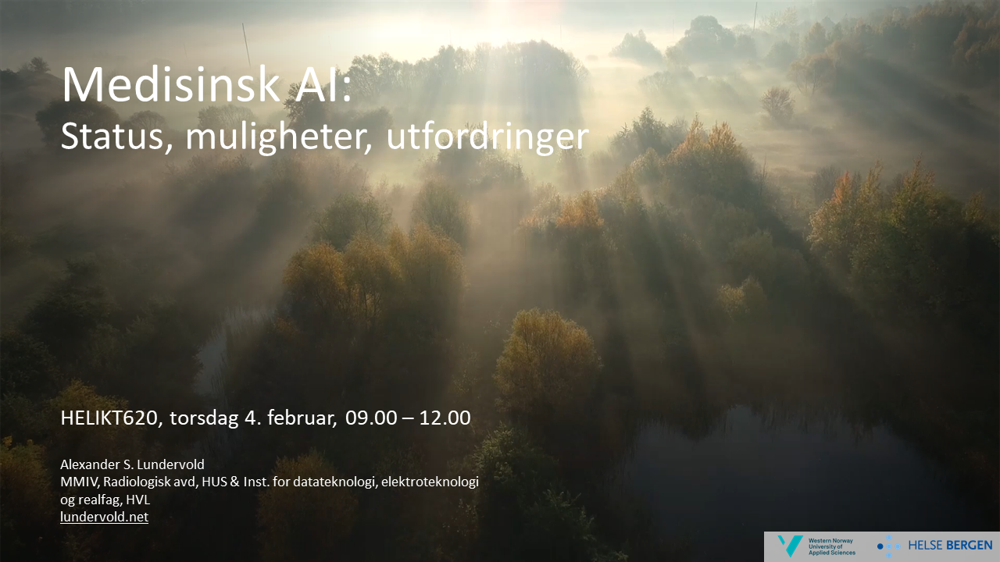
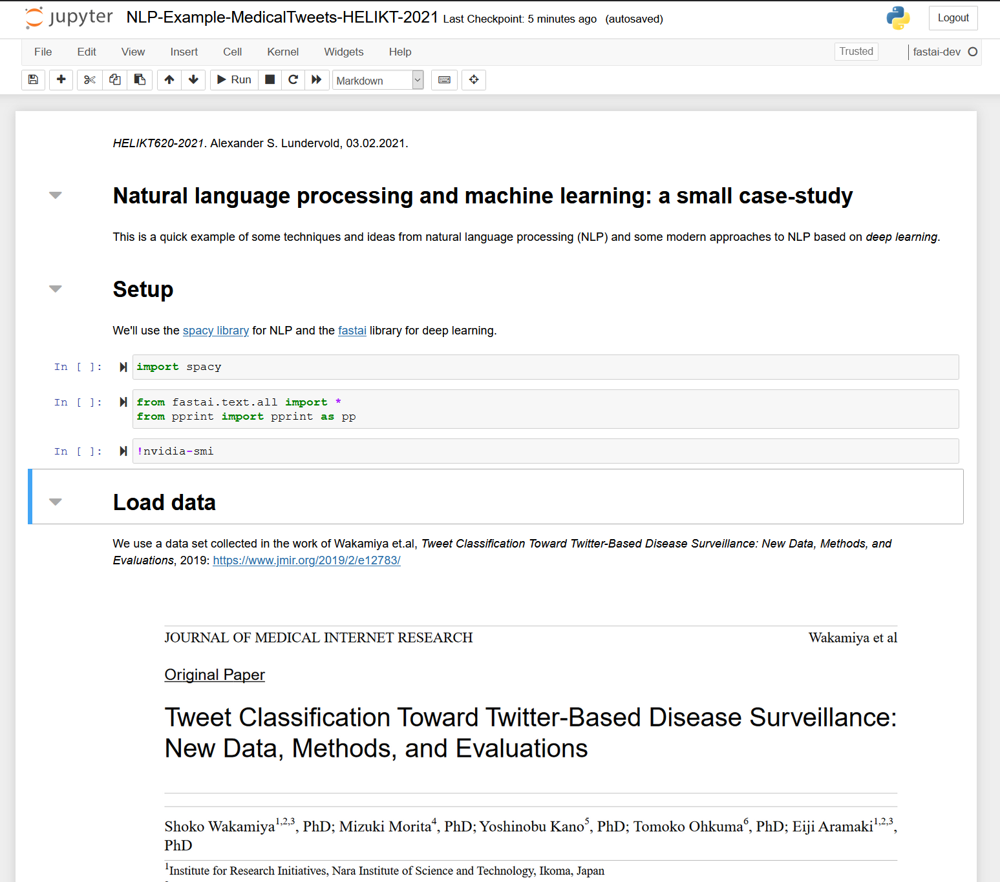

# HELIKT620-KI-2021

HELIKT620: Helseinformatikk, Universitetet i Bergen. https://www.uib.no/emne/HELIKT620

Materiale fra forelesning om kunstig intelligens i HELIKT620, 4. februar 2021.

[Alexander S. Lundervold](http://alexander.lundervold.com), [HVL](https://www.hvl.no/person/?user=3610493) & [MMIV](https://mmiv.no/).

# Presentasjon

Her er en PDF-versjon av slides fra forelesningen: 

# Kode fra hands-on-eksempel
Notebooken vi så på var [`NLP-Example-MedicalTweets-HELIKT-2021.ipynb`](NLP-Example-MedicalTweets-HELIKT-2021.ipynb).

# Anbefalt litteratur

* On the Prospects for a (Deep) Learning Health Care System, C. David Naylor, JAMA 2018, https://jamanetwork.com/journals/jama/fullarticle/2701667 
* High-performance medicine: the convergence of human and artificial intelligence, E. Topol, Nature Medicine 2019, https://www.nature.com/articles/s41591-018-0300-7 
* Artificial Intelligence Is Rushing Into Patient Care-And Could Raise Risks, Liz Szabo, Scientific American, 2019, https://www.scientificamerican.com/article/artificial-intelligence-is-rushing-into-patient-care-and-could-raise-risks
* Artificial Intelligence in Health Care: A Report From the National Academy of Medicine, M. Matheny et.al., JAMA 2019, https://jamanetwork.com/journals/jama/article-abstract/2757958
